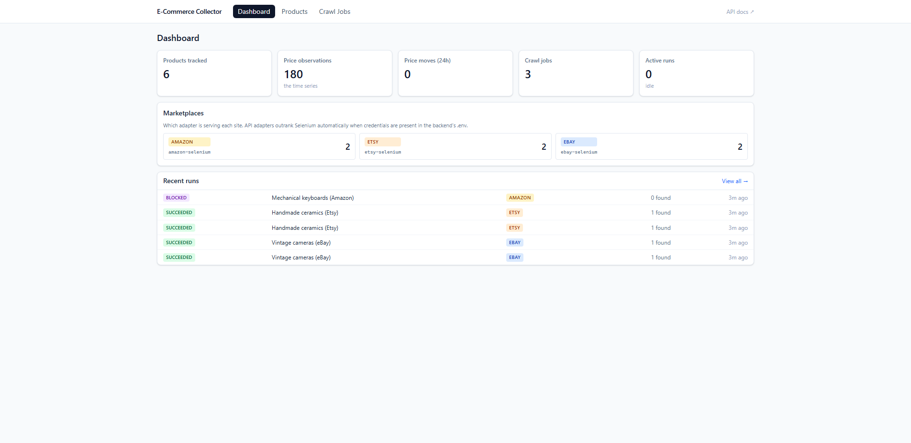
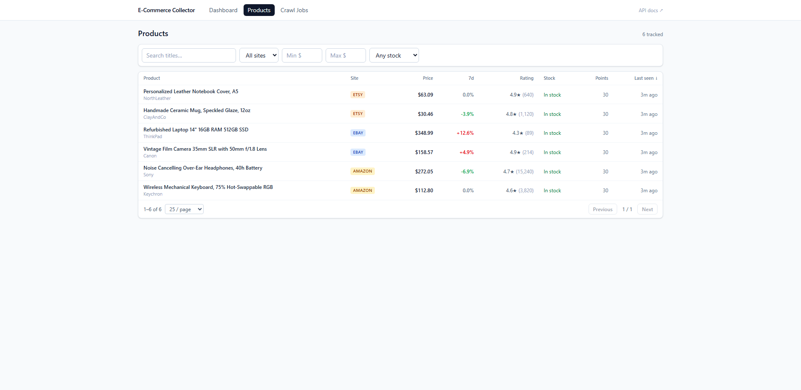
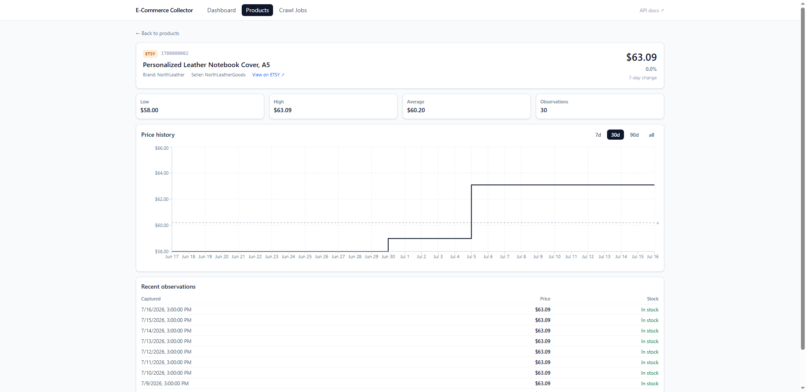

# E-Commerce Data Collector

Tracks product **prices over time** across Amazon, Etsy and eBay — a NestJS crawler with a pluggable adapter architecture, and a React dashboard to browse products, chart price history, and run crawls.

A *scraper* grabs a price once. A **collector** re-visits the same product on a schedule so you get a time series. That distinction drives the whole design: prices are append-only and never updated in place.



<table>
<tr>
<td width="50%"></td>
<td width="50%"></td>
</tr>
</table>

## Features

- **Price history, not snapshots** — every observation is an immutable row; the chart is the product
- **Pluggable marketplaces** — add a site with one adapter class; the compiler finds the one place the frontend needs updating
- **API adapters outrank scrapers** — drop in an eBay/Etsy API key and the registry switches automatically, no code change
- **Honest about being blocked** — anti-bot walls end a run as `BLOCKED` with evidence, never as a silent "success with 0 results"
- **Polite by default** — robots.txt respected, per-domain throttling, conservative rate limits
- **Offline, deterministic tests** — adapter parsing is tested against frozen HTML with the network disabled

## Stack

| | |
|---|---|
| **Backend** | NestJS 11 · Prisma 7 · MySQL 8 · Selenium 4 · TypeScript 5.9 |
| **Frontend** | React 19 · Vite 7 · TanStack Query v5 · Tailwind v4 · Recharts 3 |
| **Testing** | Jest · Selenium (fixture, E2E and live-canary tiers) |

> **Before you plan around the Selenium adapters:** eBay and Etsy disallow search scraping in their robots.txt, so with default settings those runs correctly end as `FAILED`. Amazon works. The official APIs are the real path for eBay and Etsy — see [CLAUDE.md](CLAUDE.md#reality-check-on-scraping-these-sites) for the measured results.
>
> Scraping may breach a site's terms of service regardless of what robots.txt permits. Check the terms for any site you point this at, and prefer the official API where one exists.

---

## Requirements

- **Node.js** ≥ 20.19 (Prisma 7's floor; 22.x recommended)
- **MySQL** 8.0+
- **Chrome** (any recent version)

No Docker, Java or Redis needed. **Do not install the `chromedriver` npm package** — Selenium Manager resolves a driver against your installed Chrome at runtime. A pinned driver breaks the moment Chrome auto-updates.

## Setup

### 1. Create the databases

Pick a password, put it in `prisma/init-db.sql` (replacing `CHANGE_ME`), then run it as root:

```bash
cd backend
mysql -u root -p < prisma/init-db.sql
```

<details>
<summary>Windows: mysql isn't on PATH by default</summary>

```powershell
& "C:\Program Files\MySQL\MySQL Server 8.0\bin\mysql.exe" -u root -p < prisma\init-db.sql
```
Or add `C:\Program Files\MySQL\MySQL Server 8.0\bin` to your PATH.
</details>

### 2. Backend

```bash
cd backend
cp .env.example .env          # then set DATABASE_URL to the password from step 1
npm install
npx prisma migrate dev --name init
npm run db:seed               # demo products + 30 days of price history
```

Every variable is documented in [`backend/.env.example`](backend/.env.example); the defaults are safe to leave alone. Config is validated at boot, so a bad value fails immediately with a readable message.

### 3. Frontend

```bash
cd frontend
npm install
```

## Run

Two terminals:

```bash
cd backend && npm run start:dev     # http://localhost:3000/api
cd frontend && npm run dev          # http://localhost:5173
```

- API → <http://localhost:3000/api>
- Swagger → <http://localhost:3000/api/docs>
- Dashboard → <http://localhost:5173>

Vite proxies `/api` to the backend, so dev is same-origin and **CORS never comes up**. That only holds because `VITE_API_BASE_URL` is empty — keep it that way locally.

## Test

```bash
cd backend
npm test              # unit + fixture adapter tests — offline, deterministic
npm run test:e2e      # Selenium against the dashboard (needs both servers running)
npm run test:canary   # hits LIVE sites to detect DOM drift — not for CI
```

| Tier | Proves | CI |
|---|---|---|
| Unit | Price/rating/URL normalization, block detection | ✅ |
| Fixture | Real parser, real Chrome, frozen HTML, network disabled | ✅ |
| E2E | Dashboard flows against real API + DB | ✅ |
| Canary | Live DOM still matches our selectors | ❌ never |

Why the tiers are split this way — and how to refresh a fixture — is in [CLAUDE.md](CLAUDE.md#testing-philosophy).

## Project structure

```
backend/
├─ prisma/                  schema, migrations, seed, init-db.sql
└─ src/
   ├─ crawler/
   │  ├─ adapters/          MarketplaceAdapter + one folder per site
   │  ├─ driver/            WebDriverFactory (pooling, lifecycle)
   │  ├─ pipeline/          CrawlRunner: adapter → normalize → upsert
   │  ├─ politeness/        robots.txt, throttle, block detection
   │  └─ queue/             ICrawlQueue, in-memory impl, scheduler
   ├─ products/  crawl-jobs/  stats/  health/
   └─ prisma/  config/

frontend/src/
├─ api/          typed client, query keys
├─ domain/       marketplace + run-status registries (the extension seam)
├─ hooks/        TanStack Query hooks
├─ pages/        one folder per page: index.tsx + components/
└─ components/   shared UI
```

---

**[CLAUDE.md](CLAUDE.md)** covers the rest: design rationale and invariants, the measured reality of scraping each site, adding a marketplace, testing philosophy, the full environment table, and troubleshooting.
